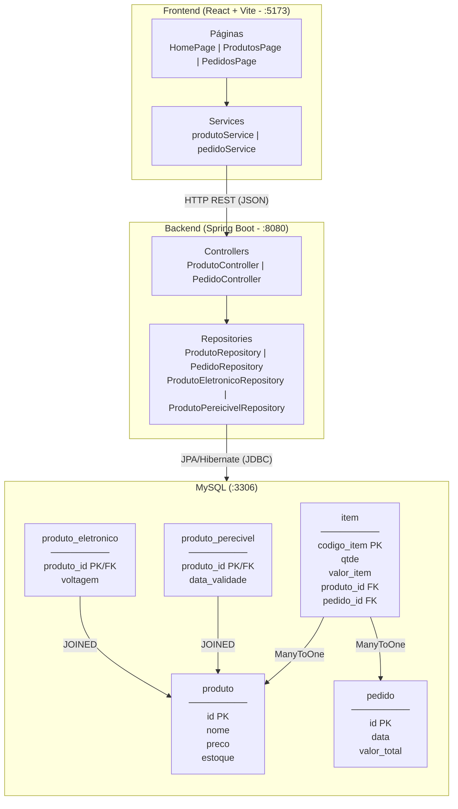
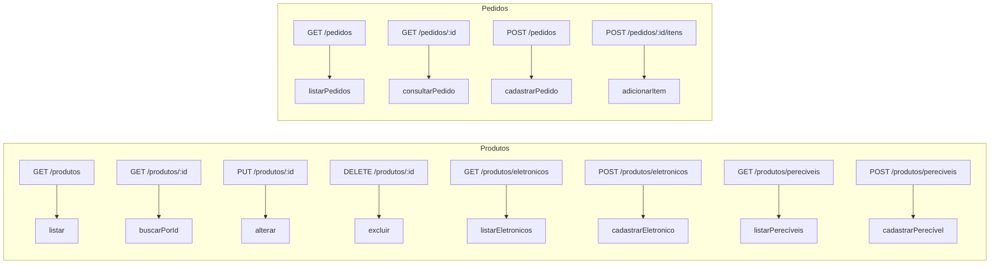
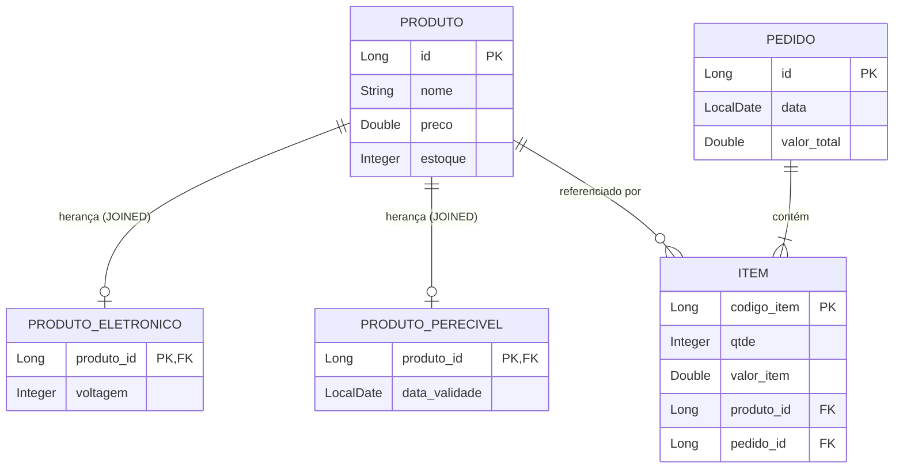

# Arquitetura do Sistema de Pedidos

## Visão Geral

```mermaid
graph TB
    subgraph Frontend["Frontend (React + Vite - :5173)"]
        Pages["Páginas<br/>HomePage | ProdutosPage | PedidosPage"]
        Services["Services<br/>produtoService | pedidoService"]
        Pages --> Services
    end

    subgraph Backend["Backend (Spring Boot - :8080)"]
        Controllers["Controllers<br/>ProdutoController | PedidoController"]
        Repositories["Repositories<br/>ProdutoRepository | PedidoRepository<br/>ProdutoEletronicoRepository | ProdutoPereicivelRepository"]
        Controllers --> Repositories
    end

    subgraph MySQL["MySQL (:3306)"]
        direction TB
        produto["produto<br/>─────────<br/>id PK<br/>nome<br/>preco<br/>estoque"]
        produto_eletronico["produto_eletronico<br/>─────────<br/>produto_id PK/FK<br/>voltagem"]
        produto_perecivel["produto_perecivel<br/>─────────<br/>produto_id PK/FK<br/>data_validade"]
        pedido["pedido<br/>─────────<br/>id PK<br/>data<br/>valor_total"]
        item["item<br/>─────────<br/>codigo_item PK<br/>qtde<br/>valor_item<br/>produto_id FK<br/>pedido_id FK"]
    end

    Services -->|"HTTP REST (JSON)"| Controllers
    Repositories -->|"JPA/Hibernate (JDBC)"| MySQL

    produto_eletronico -->|"JOINED"| produto
    produto_perecivel -->|"JOINED"| produto
    item -->|"ManyToOne"| produto
    item -->|"ManyToOne"| pedido
```

## Rotas REST

```mermaid
flowchart LR
    subgraph Produtos
        GET1["GET /produtos"] --> listar
        GET2["GET /produtos/:id"] --> buscarPorId
        PUT1["PUT /produtos/:id"] --> alterar
        DEL1["DELETE /produtos/:id"] --> excluir
        GET3["GET /produtos/eletronicos"] --> listarEletronicos
        POST1["POST /produtos/eletronicos"] --> cadastrarEletronico
        GET4["GET /produtos/pereciveis"] --> listarPerecíveis
        POST2["POST /produtos/pereciveis"] --> cadastrarPerecível
    end

    subgraph Pedidos
        GET5["GET /pedidos"] --> listarPedidos
        GET6["GET /pedidos/:id"] --> consultarPedido
        POST3["POST /pedidos"] --> cadastrarPedido
        POST4["POST /pedidos/:id/itens"] --> adicionarItem
    end
```

## Modelo do Banco (ER)

```mermaid
erDiagram
    PRODUTO {
        Long id PK
        String nome
        Double preco
        Integer estoque
    }

    PRODUTO_ELETRONICO {
        Long produto_id PK,FK
        Integer voltagem
    }

    PRODUTO_PERECIVEL {
        Long produto_id PK,FK
        LocalDate data_validade
    }

    PEDIDO {
        Long id PK
        LocalDate data
        Double valor_total
    }

    ITEM {
        Long codigo_item PK
        Integer qtde
        Double valor_item
        Long produto_id FK
        Long pedido_id FK
    }

    PRODUTO ||--o| PRODUTO_ELETRONICO : "herança (JOINED)"
    PRODUTO ||--o| PRODUTO_PERECIVEL : "herança (JOINED)"
    PEDIDO ||--|{ ITEM : "contém"
    PRODUTO ||--o{ ITEM : "referenciado por"
```
